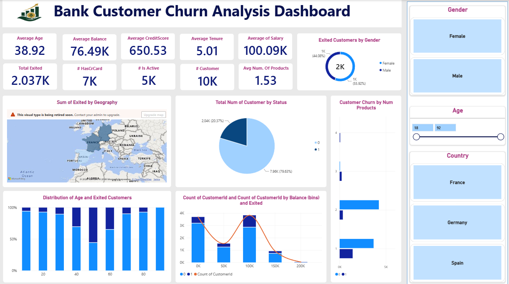

# 📊 Bank Customer Churn Analysis

> Understanding customers before they choose to leave.

An interactive Power BI dashboard built to analyze customer churn and explore the factors behind customer exits. The dashboard brings together customer demographics, financial details, activity, products, and geographic information to identify meaningful churn patterns.

## Dashboard

## Analysis

- Customer churn by gender and country
- Age-wise churn patterns
- Balance and salary analysis
- Credit score and tenure analysis
- Customer activity and credit card ownership
- Churn based on number of products
- Geographic distribution of exited customers

## Key Metrics

- Total Customers
- Total Exited Customers
- Average Age
- Average Balance
- Average Credit Score
- Average Tenure
- Average Salary
- Average Number of Products

## Tools

**Power BI** · **Data Analysis** · **Data Visualization**

## Objective

Turn customer data into clear insights that can help understand churn behavior and support better business decisions.

---

> "Good analysis doesn't just show what happened. It helps explain why."
